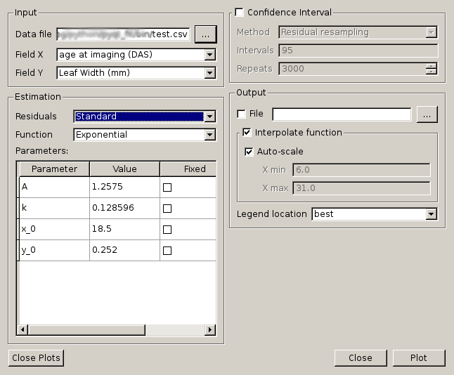
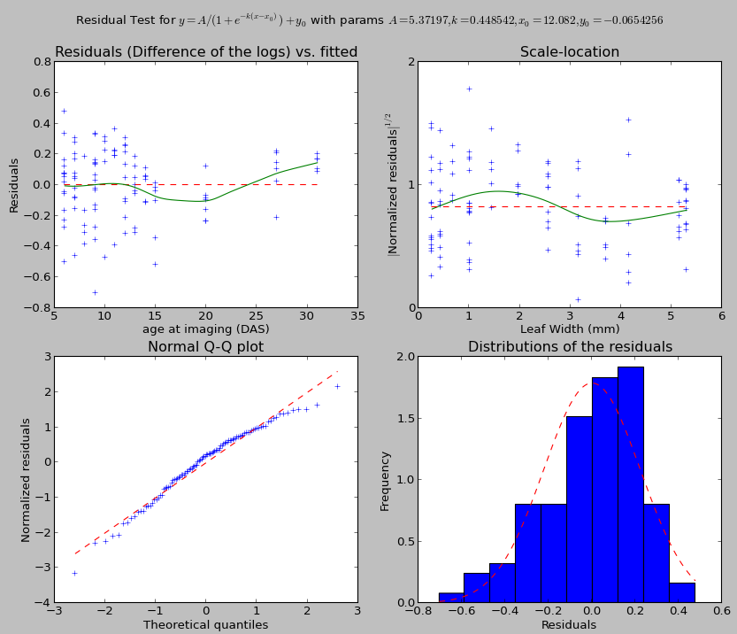

.. Tutorial on the use of the GUI

Regression using the GUI - tutorial
===================================

Using the interface
-------------------

The script is starting from the command line with:

.. code-block:: console

  $ pyqt_fit1d.py

Once starting the script, the interface will look like this:

.. _GUI-tut-GUI:

  Main GUI of PyQt-Fit

The interface is organised in 4 sections:

1. the top-left of the window to define the data to load and process;
2. the bottom-left to define the function to be fitted and its parameters;
3. the top-right to define the options to compute confidence intervals;
4. the bottom-right to define the output options.

Loading the Data
^^^^^^^^^^^^^^^^
The application can load CSV files. The first line of the file must be the name
of the available datasets. In case of missing data, only what is available on
the two selected datasets are kept.

Once loaded, the available data sets will appear as option in the combo-boxes.
You need to select for the X axis the explaining variable and the explained
variable on the Y axis.

Defining the regression function
^^^^^^^^^^^^^^^^^^^^^^^^^^^^^^^^
First, you will want to choose the function. The available functions are listed
in the combo box. When selecting a function, the list of parameters appear in
the list below. The value presented are estimated are a quick estimation from
the data. You can edit them by double-clicking. It is also where you can
specify if the parameter is of known value, and should therefore be fixed.

If needed, you can also change the computation of the residuals. By default
there are two kind of residuals:

  Standard
    residuals are simply the difference between the estimated and observed value.

  Difference of the logs
    residual are the difference of the log of the values.

Plotting and output
^^^^^^^^^^^^^^^^^^^
By default, the output consists in the data points, and the fitted function,
interpolated on the whole range of the input data. If is, however, possible to
both change the range of data, or even evaluate the function on the existing
data points rather than interpolated ones.

The output also presents a window to evaluate the quality of the fitting:

In general, the dashed red line is the target to achieve for a good fitting.
When present the green line is the estimates that should match the red line.

The top-left graph presents the distribution of the residuals against the
explaining variable. The green line shows a local-linear regression of the
residuals. It should be aligned with the dashed red line.

The top-right graph presents the distribution of the square root of the
standardized residuals against the explained variable. The purpose of this
graph is to test the uniformity of the distribution. The green line is again a
local-linear regression of the points. The line should be as flat and
horizontal as possible. If the distribution is normal, the green line should
match the dashed red line.

The bottom right graph presents a histogram of the residuals. For parametric
fitting, the residuals should globally be normal.

The bottom left graph presents a QQ-plot, matching the theoretical quantiles
and the standardized residuals. If the residuals are normally distributed, the
points should be on the dashed red line.

The result of the fitting can also be output. What is written correspond
exactly to what is displayed. The output is also a CSV file, and is meant to be
readable by a human.

Confidence interval
^^^^^^^^^^^^^^^^^^^
Confidence interval can be computed using bootstrapping. There are two kinds of
boostrapping implemented:

  regular bootstrapping
    The data are resampled, the pairs :math:`(x,y)` are kept. There is no
    assumption made. But is is often troublesome in regression, tending to
    flatten the results.

  residual resampling
    After the first evaluation, for each pair :math:`(x,y)`, we find the
    estimated value :math:`\hat{y}`. Then, the residuals are re-sampled, and
    new pairs :math:`(x,\hat{y}+r')` are recreated, :math:`r'` being the
    resampled residual.

The intervals ought to be a list of semi-colon separated values of percentages.
At last, the number of repeats will define how many re-sampling there will be.

Defining your own function
--------------------------
First, you need to define the environment variable ``PYQTFIT_PATH`` and add a
list of colon-separated folders. In each folder, you can add python modules in
a ``functions`` sub-folder. For example, if the path ``~/.pyqtfit`` is in
``PYQTFIT_PATH``, then you need to create a folder ``~/.pyqtfit/functions``, in
which you can add your own python modules.

Which module will be loaded, and the functions defined in it will be added in
the interface. A function is a class or an object with the following
properties:

  ``name``
    Name of the function

  ``description``
    Equation of the function

  ``args``
    List of arguments

  ``__call__(args, x)``
    Compute the function. The ``args`` argument is a tuple or list with as many
    elements are in the ``args`` attribute of the function.

  ``init_args(x,y)``
    Function guessing some initial arguments from the data. It must return a
    list or tuple of values, one per argument to the function.

  ``Dfun(args, x)``
    Compute the jacobian of the function at the points ``c``. If the function
    is not provided, the attribute should be set to None, and the jacobian will
    be estimated numerically.

As an example, here is the definition of the cosine function::

  import numpy as np

  class Cosine(object):
    name = "Cosine"
    args = "y0 C phi t".split()
    description = "y = y0 + X cos(phi x + t)"

    @staticmethod
    def __call__((y0,C,phi,t), x):
      return y0 + C*np.cos(phi*x+t)

    Dfun = None

    @staticmethod
    def init_args(x, y):
      C = y.ptp()/2
      y0 = y.min() + C
      phi = 2*np.pi/x.ptp()
      t = 0
      return (y0, C, phi, t)

Defining your own residual
--------------------------

Similarly to the functions, it is possible to implement your own residual. The
rediduals need to be in a ``residuals`` folder. And they need to be object or
classes with the following properties:

  ``name``
    Name of the residuals

  ``description``
    Formula used to compute the residuals

  ``__call__(y1, y0)``
    Function computing the residuals, ``y1`` being the original data and ``y0``
    the estimated data.

  ``invert(y, res)``
    Function applying the residual to the estimated data.

  ``Dfun(y1, y0, dy)``
    Compute the jacobian of the residuals. ``y1`` is the original data, ``y0``
    the estaimted data and ``dy`` the jacobian of the function at ``y0``.

As an example, here is the definition of the log-residuals::

  class LogResiduals(object):
    name = "Difference of the logs"
    description = "log(y1/y0)"

    @staticmethod
    def __call__(y1, y0):
      return log(y1/y0)

    @staticmethod
    def Dfun(y1, y0, dy):
      """
      J(log(y1/y0)) = -J(y0)/y0
      where J is the jacobian and division is element-wise (per row)
      """
      return -dy/y0[newaxis,:]

    @staticmethod
    def invert(y, res):
      """
      Multiply the value by the exponential of the residual
      """
      return y*exp(res)

