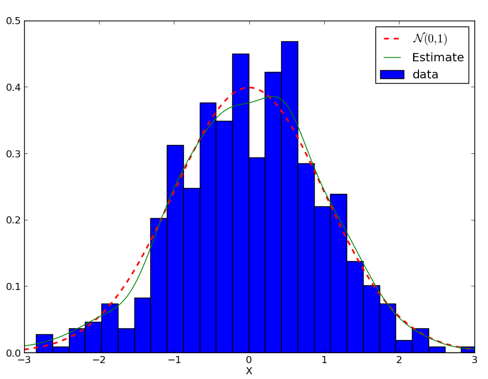
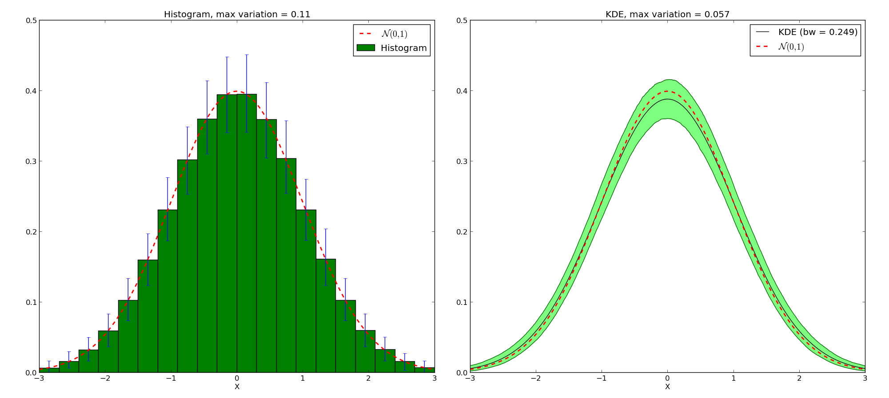
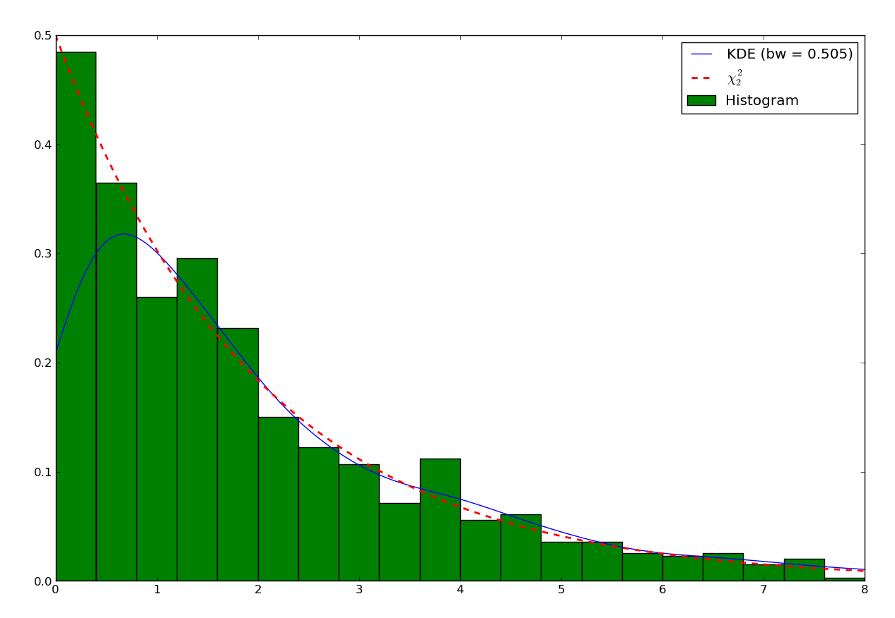
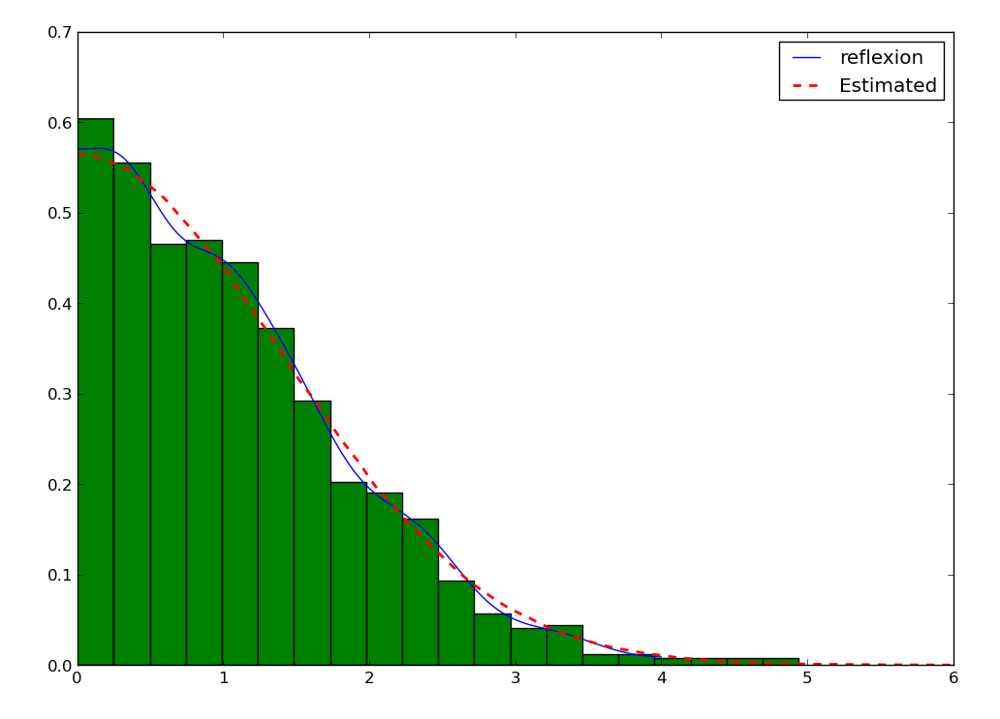
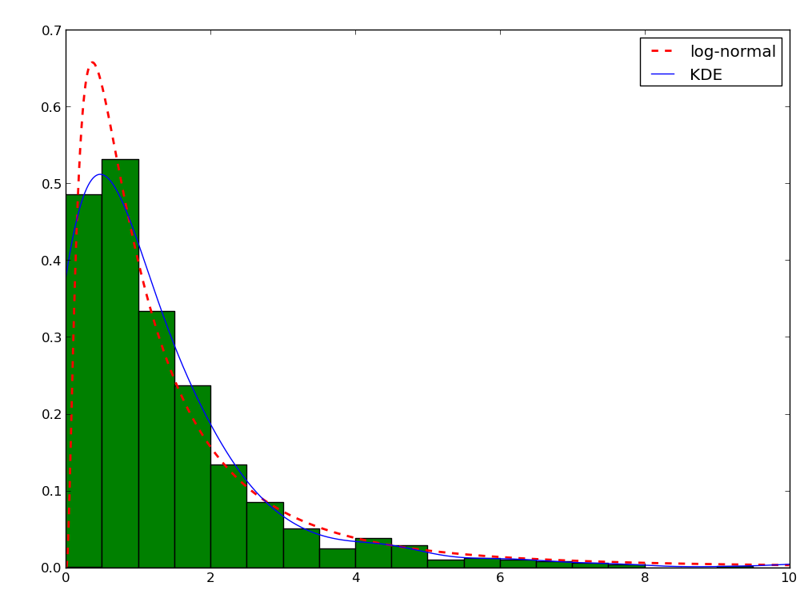
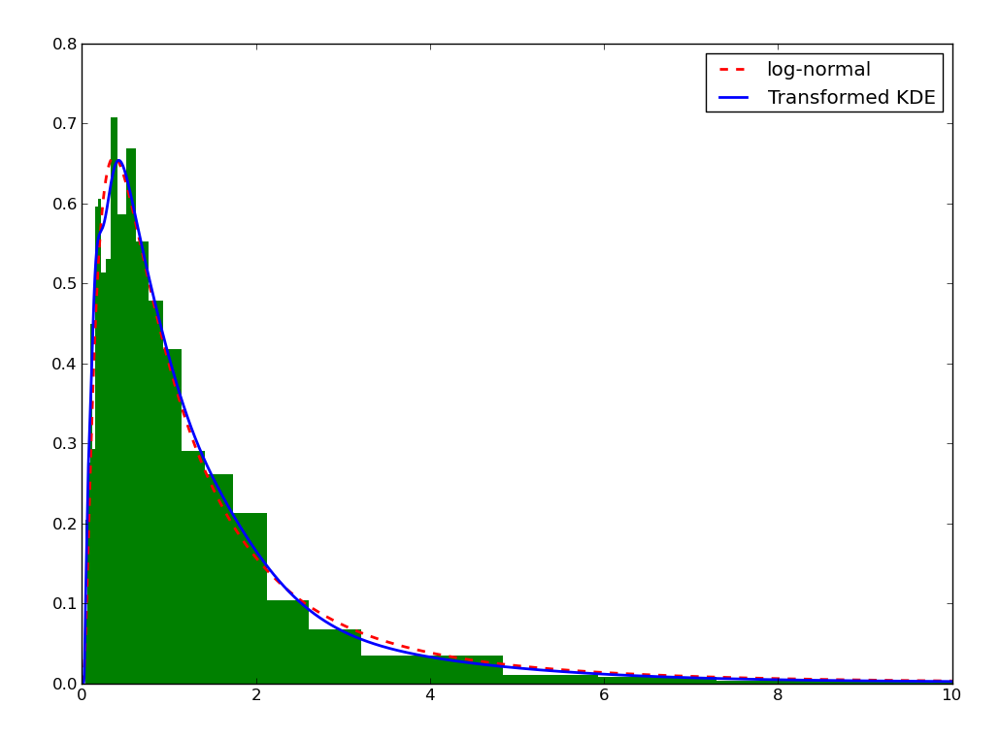

.. Kernel Density Estimation tutorial

Kernel Density Estimation tutorial
==================================

Introduction
------------

Kernel Density Estimation is a method to estimate the frequency of a given value given a random
sample.

Given a set of observations :math:`(x_i)_{1\leq i \leq n}`. We assume the observations are a random
sampling of a probability distribution :math:`f`. We first consider the kernel estimator:

.. math::

  \hat{f}(x) = \frac{1}{Wnh} \sum_{i=1}^n \frac{w_i}{\lambda_i} K\left(\frac{x_i - x}{h\lambda_i}\right)

Where:
  1. :math:`K: \R^p\rightarrow \R` is the kernel, a function centered on 0 and that integrates to 1;
  2. math:`h` is the bandwidth, a smoothing parameter that would typically tend to 0 when the number of samples
     tend to :math:`\infty`;
  3. :math:`(w_i)` are the weights of each of the points, and :math:`W` is the sum of the weigths;
  4. :math:`(\lambda_i)` are the adaptation factor of the kernel.

Also, it is desirable if the second moment of the kernel (i.e. the variance) is 1 for the bandwidth
to keep a uniform meaning across the kernels.

A simple example
----------------

First, let's assume we have a random variable following a normal law :math:`\mathcal{N}(0,1)`, and
let's plot its histogram::

  >>> import numpy as np
  >>> from scipy.stats import norm
  >>> from matplotlib import pylab as plt
  >>> f = norm(loc=0, scale=1)
  >>> x = f.rvs(500)
  >>> xs = np.r_[-3:3:1024j]
  >>> ys = f.pdf(xs)
  >>> h = plt.hist(x, bins=30, normed=True, color=(0,.5,0,1), label='Histogram')
  >>> plt.plot(xs, ys, 'r--', linewidth=2, label='$\mathcal{N}(0,1)$')
  >>> plt.xlim(-3,3)
  >>> plt.xlabel('X')

We can get estimate the density with::

  >>> from pyqt_fit import kde
  >>> est = kde.KDE1D(x)
  >>> plot(xs, est(xs), label='Estimate (bw={:.3g})'.format(est.bandwidth))
  >>> plt.legend(loc='best')



You may wonder why use KDE rather than a histogram. Let's test the variability of both method. To
that purpose, let first generate a set of a thousand datasets and the corresponding histograms and
KDE, making sure the width of the KDE and the histogram are the same::

  >>> import numpy as np
  >>> from scipy.stats import norm
  >>> from pyqt_fit import kde
  >>> f = norm(loc=0, scale=1)
  >>> xs = np.r_[-3:3:1024j]
  >>> nbins = 20
  >>> x = f.rvs(1000*1000).reshape(1000,1000)
  >>> hs = np.empty((1000, nbins), dtype=float)
  >>> kdes = np.empty((1000, 1024), dtype=float)
  >>> hs[0], edges = np.histogram(x[0], bins=nbins, range=(-3,3), density=True)
  >>> mod = kde.KDE1D(x[0])
  >>> mod.fit()  # Force estimation of parameters
  >>> mod.bandwidth = mod.bandwidth  # Prevent future recalculation
  >>> kdes[0] = mod(xs)
  >>> for i in range(1, 1000):
  >>>   hs[i] = np.histogram(x[i], bins=nbins, range=(-3,3), density=True)[0]
  >>>   mod.xdata = x[i]
  >>>   kdes[i] = mod(xs)

Now, let's find the mean and the 90% confidence interval::

  >>> h_mean = hs.mean(axis=0)
  >>> h_ci = np.array(np.percentile(hs, (5, 95), axis=0))
  >>> h_err = np.empty(h_ci.shape, dtype=float)
  >>> h_err[0] = h_mean - h_ci[0]
  >>> h_err[1] = h_ci[1] - h_mean
  >>> kde_mean = kdes.mean(axis=0)
  >>> kde_ci = np.array(np.percentile(kdes, (5, 95), axis=0))
  >>> width = edges[1:]-edges[:-1]
  >>> fig = plt.figure()
  >>> ax1 = fig.add_subplot(1,2,1)
  >>> ax1.bar(edges[:-1], h_mean, yerr=h_err, width = width, label='Histogram',
  ...         facecolor='g', edgecolor='k', ecolor='b')
  >>> ax1.plot(xs, f.pdf(xs), 'r--', lw=2, label='$\mathcal{N}(0,1)$')
  >>> ax1.set_xlabel('X')
  >>> ax1.set_xlim(-3,3)
  >>> ax1.legend(loc='best')
  >>> ax2 = fig.add_subplot(1,2,2)
  >>> ax2.fill_between(xs, kde_ci[0], kde_ci[1], color=(0,1,0,.5), edgecolor=(0,.4,0,1))
  >>> ax2.plot(xs, kde_mean, 'k', label='KDE (bw = {:.3g})'.format(mod.bandwidth))
  >>> ax2.plot(xs, f.pdf(xs), 'r--', lw=2, label='$\mathcal{N}(0,1)$')
  >>> ax2.set_xlabel('X')
  >>> ax2.legend(loc='best')
  >>> ymax = max(ax1.get_ylim()[1], ax2.get_ylim()[1])
  >>> ax2.set_ylim(0, ymax)
  >>> ax1.set_ylim(0, ymax)
  >>> ax1.set_title('Histogram, max variation = {:.3g}'.format((h_ci[1] - h_ci[0]).max()))
  >>> ax2.set_title('KDE, max variation = {:.3g}'.format((kde_ci[1] - kde_ci[0]).max()))
  >>> fig.suptitle('Comparison Histogram vs. KDE')



   Comparison Histogram / KDE -- KDE has less variability

Note that the KDE doesn't tend toward the true density. Instead, given a kernel :math:`K`,
the mean value will be the convolution of the true density with the kernel. But for that price, we
get a much narrower variation on the values. We also avoid boundaries issues linked with the choices of where the bars 
of the histogram start and stop.

Boundary Conditions
-------------------

Simple Boundary
```````````````

One of the main focus of the implementation is the estimation of density on bounded domain. As an
example, let's try to estimate the KDE of a dataset following a :math:`\chi^2_2` distribution. As a
reminder, the PDF of this distribution is:

.. math::

   \chi^2_2(x) = \frac{1}{2}e^{-\frac{x}{2}}

This distribution is only defined for :math:`x>0`. So first let's look at the histogram and the
default KDE::

  >>> from scipy import stats
  >>> from matplotlib import pylab as plt
  >>> from pyqt_fit import kde, kde_methods
  >>> import numpy as np
  >>> chi2 = stats.chi2(2)
  >>> x = chi2.rvs(1000)
  >>> plt.hist(x, bins=20, range=(0,8), color=(0,.5,0), label='Histogram', normed=True)
  >>> est = kde.KDE1D(x)
  >>> xs = np.r_[0:8:1024j]
  >>> plt.plot(xs, est(xs), label='KDE (bw = {:.3g})'.format(est.bandwidth))
  >>> plt.plot(xs, chi2.pdf(xs), 'r--', lw=2, label=r'$\chi^2_2$')
  >>> plt.legend(loc='best')



   Standard estimation of the :math:`\chi^2_2` distribution

We can see that the estimation is correct far from the 0, but when closer than twice the bandwidth,
the estimation becomes incorrect. The reason is that the method "sees" there are no points below 0,
and therefore assumes the density continuously decreases to reach 0 in slightly negative values. 
Moreover, if we integrate the KDE in the domain :math:`[0,\infty]`::

  >>> from scipy import integrate
  >>> integrate.quad(est, 0, np.inf)
  (0.9138087148449997, 2.7788548831933142e-09)

we can see the distribution sums up only to about 0.91, instead of 1. In short, we are "loosing 
weight".

There are a number of ways to take into account the bounded nature of the distribution and correct 
with this loss. A common one consists in truncating the kernel if it goes below 0. This is called 
"renormalizing" the kernel. The method can be specified setting the ``method`` attribute of the KDE 
object to :py:data:`pyqt_fit.kde_methods.renormalization`::

  >>> est_ren = kde.KDE1D(x, lower=0, method=kde_methods.renormalization)
  >>> plt.plot(xs, est_ren(xs), 'm', label=est_ren.method.name)
  >>> plt.legend(loc='best')


   Renormalized estimation of the :math:`\chi^2_2` distribution

It can be shown that the convergence at the boundary with the renormalization method is slower than
in the rest of the dataset. Another method is a linear approximation of the density toward the
boundaries. The method, being an approximation, will not sum up to exactly 1. However, it often
approximate the density much better::

  >>> from pyqt_fit import kde_methods
  >>> est_lin = kde.KDE1D(x, lower=0, method=kde_methods.linear_combination)
  >>> plt.plot(xs, est_lin(xs), 'y', label=est_lin.method.name)
  >>> plt.legend(loc='best')


   Linear combination estimation of the :math:`\chi^2_2` distribution

Reflective Boundary
```````````````````
Sometimes, not only do we have a boundary, but we expect the density to be reflective, that is the 
derivative on the boundary is 0, we expect the data to behave the same as being repeated by 
reflection on the boundaries. An example is the distribution of the distance from a 2D point taken 
from a 2D gaussian distribution to the center:

.. math::

   Z = |X - Y| \qquad X \sim \mathcal{N}(0,1), Y \sim \mathcal{N}(0,1)

First, let's look at the histogram::

  >>> from scipy import stats, integrate
  >>> from matplotlib import pylab as plt
  >>> from pyqt_fit import kde, kde_methods
  >>> import numpy as np
  >>> f = stats.norm(loc=0, scale=1)
  >>> x = f.rvs(1000)
  >>> y = f.rvs(1000)
  >>> z = np.abs(x-y)
  >>> plt.hist(z, bins=20, facecolor=(0,.5,0), normed=True)

Then, the KDE assume reflexive boundary conditions::

  >>> xs = np.r_[0:8:1024j]
  >>> est = kde.KDE1D(z, lower=0, method=kde_methods.reflection)
  >>> plot(xs, est(xs), color='b', label=est.method.name)

To estimate the "real" distribution, we will increase the number of samples::

  >>> xx = f.rvs(1000000)
  >>> yy = f.rvs(1000000)
  >>> zz = np.abs(xx-yy)

If you try to estimate the KDE, it will now be very slow. To speed up the process, you can use the 
``grid`` method. The ``grid`` method will compute the result using DCT or FFT if possible. It will 
work only if you don't have variable bandwidth and boundary conditions are either reflexive, cyclic, 
or non-existent (i.e. unbounded)::

  >>> est_large = kde.KDE1D(zz, lower=0, method=kde_methods.reflection)
  >>> xxs, yys = est_large.grid()
  >>> plt.plot(xxs, yys, 'r--', lw=2, label='Estimated')
  >>> plt.xlim(0, 6)
  >>> plt.ylim(ymin=0)
  >>> plt.legend(loc='best')



Cyclic Boundaries
`````````````````

Cyclic boundaries work very much like reflexive boundary. The main difference is that they require
two bounds, as reflexive conditions can be only with one bound.

Methods for Bandwidth Estimation
--------------------------------

There are a number of ways to estimate the bandwidth. The simplest way is to specify it numerically,
either during construction or after::

  >>> est = kde.KDE1D(x, bandwidth=.1)
  >>> est.bandwidth = .2

If is sometimes more convenient to specify the variance of the kernel (which is the square
bandwidth). So these are equivalent to the two previous lines::

  >>> est = kde.KDE1D(x, bandwidth=.01)
  >>> est.covariance = .04

But often you will want to use a pre-defined method::

  >>> est = kde.KDE1D(x, covariance = kde.scotts_covariance)

At last, if you want to define your own method, you simply need to define a function. For example,
you can re-define and use the function for the Scotts rule of thumb (which compute the variance of
the kernel)::

  >>> def my_scotts(x, model=None):
  ...   return (0.75 * len(x))**-.2 * x.var()
  >>> est = kde.KDE1D(x, covariance=my_scotts)

The model object is a reference to the KDE object and is mostly useful if you need to know about the
boundaries of the domain.

Transformations
---------------

Sometimes, it is not really possible to estimate correctly the density is the current domain. A
transformation is required. As an example, let's try to estimate a log-normal distribution, i.e. the
distribution of a variable whose logarithm is normally distributed::

  >>> from scipy import stats
  >>> from matplotlib import pylab as plt
  >>> from pyqt_fit import kde, kde_methods
  >>> import numpy as np
  >>> f = stats.lognorm(1)
  >>> x = f.rvs(1000)
  >>> xs = r_[0:10:4096j]
  >>> plt.hist(x, bins=20, range=(0,10), color='g', normed=True)
  >>> plt.plot(xs, f.pdf(xs), 'r--', lw=2, label='log-normal')
  >>> est = kde.KDE1D(x, method=kde_methods.linear_combination, lower=0)
  >>> plt.plot(xs, est(xs), color='b', label='KDE')
  >>> plt.legend(loc='best')



You can note that even the histogram doesn't reflect very well the distribution here. The linear
recombination method, although not perfect also gives a better idea of what is going on. But really,
we should be working in log space::

  >>> plt.figure()
  >>> lx = np.log(x)
  >>> h, edges = np.histogram(lx, bins=30, range=(-np.log(30), np.log(10)))
  >>> width = np.exp(edges[1:]) - np.exp(edges[:-1])
  >>> h = h / width
  >>> h /= len(x)
  >>> plt.bar(np.exp(edges[:-1]), h, width = width, facecolor='g', linewidth=0, ecolor='b')
  >>> plt.plot(xs, f.pdf(xs), 'r--', lw=2, label='log-normal')
  >>> plt.xlim(xmax=10)
  >>> plt.legend(loc='best')

We can do the same for the KDE by using the `transformKDE` method. This method requires the transformation as argument::

  >>> trans = kde.KDE1D(x, method=kde_methods.transformKDE1D(kde_methods.LogTransform))
  >>> plt.plot(xs, trans(xs), color='b', lw=2, label='Transformed KDE')
  >>> plt.legend(loc='best')



