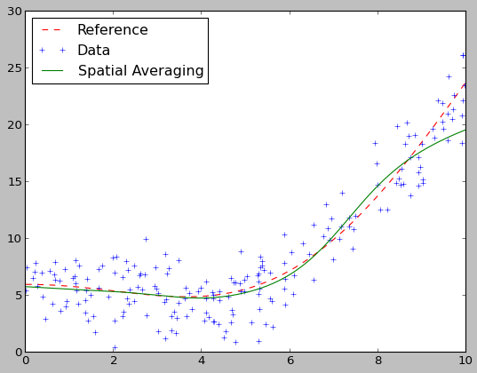
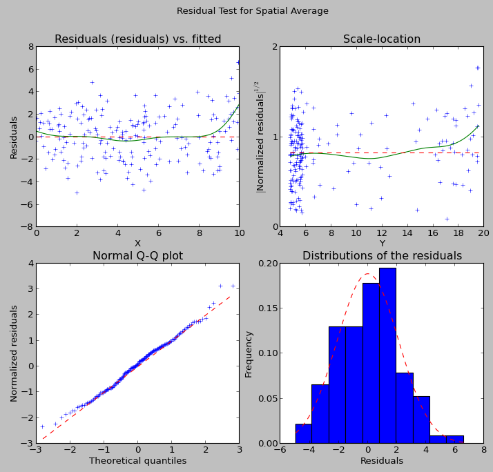
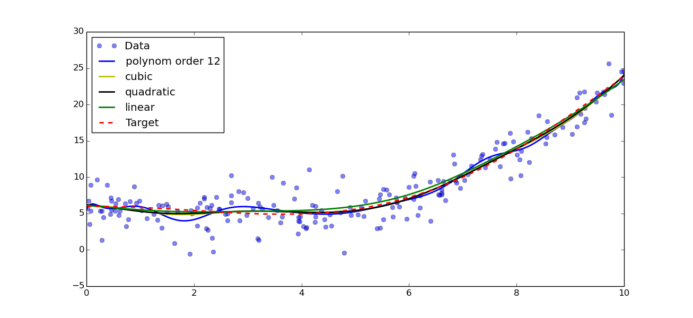
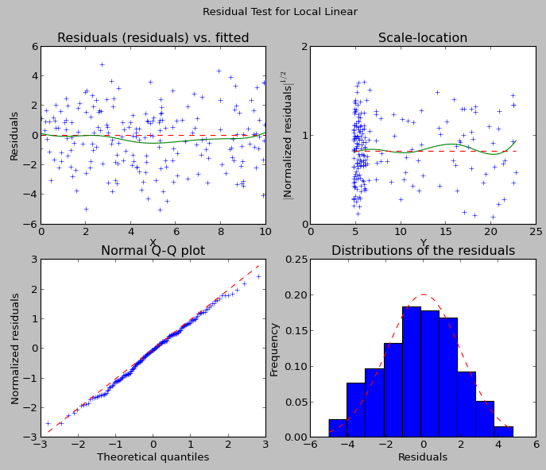
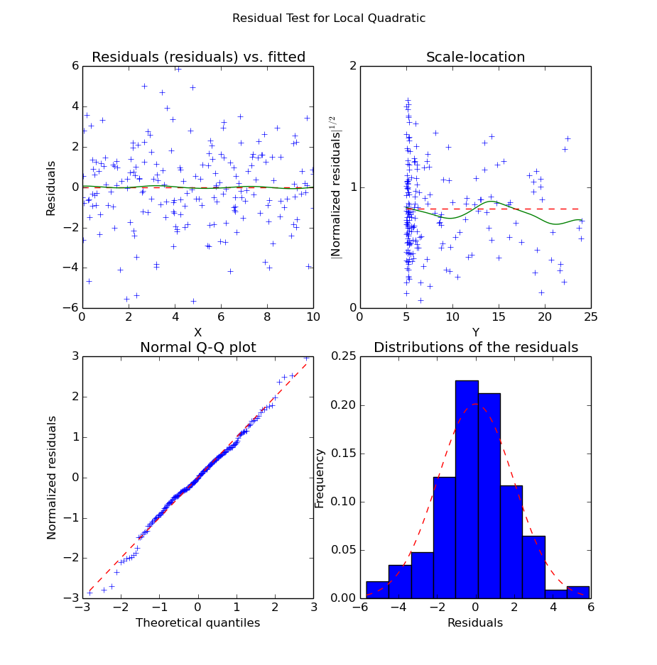
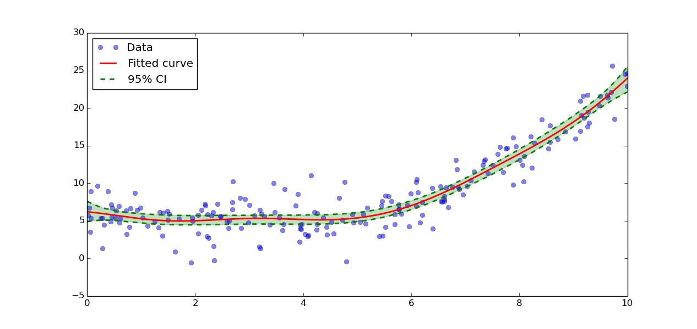

.. Python-based non-parametric regrssion tutorial

Non-Parametric regression tutorial
==================================

Introduction
------------

In general, given a set of observations :math:`(x_i,y_i)`, with :math:`x_i =
(x_{i1}, \ldots, x_{ip})^T \in \R^p`. We assume there exists a function
:math:`f(x)` such that:

.. math::

  y_i = f(x_i) + \epsilon_i

with :math:`\epsilon_i \in\R` such that :math:`E(\epsilon) = 0`. This function,
however, is not accessible. So we will consider the function :math:`\hat{f}` such that:

.. math::

  \hat{f}(x) = \argmin_f \left( y_i - f(x_i) \right)^2

The various methods presented here consists in numerical approximations finding
the minimum in a part of the function space. The most general method offered by
this module is called the local-polynomial smoother. It uses the
Taylor-decomposition of the function f on each point, and a local weigthing of
the points, to find the values. The function is then defined as:

.. math::

  \hat{f}_n(x) = \argmin_{a_0} \sum_i K\left(\frac{x-x_i}{h}\right) \left(y_i - \mathcal{P}_n(x_i)\right)^2

Where :math:`\mathcal{P}_n` is a polynomial of order :math:`n` whose constant
term is :math:`a_0`, :math:`K` is a kernel used for weighing the values and
:math:`h` is the selected bandwidth. In particular, in 1D:

.. math::

  \hat{f}_n(x) = \argmin_{a_0} \sum_i K\left(\frac{x-x_i}{h}\right) \left(y_i - a_0 - a_1(x-x_i) - \ldots - a_n\frac{(x-x_i)^n}{n!}\right)^2

In general, higher polynomials will reduce the error term but will overfit the
data, in particular at the boundaries.

..  The usual theoretical criterion to
..  estimate how good the fit is is called Mean Integrated Square Error (MISE):
..
..  .. math
..
..    \text{MISE}(\hat{f}) = E\left(\int_{\R^p}\left[\hat{f}(x) - f(x)\right]^2 dx\right)
..
..  where :math:`\hat{f}` is the estimated function and :math:`f` the real function.

A simple example
----------------

For our example, lets first degine our target function::

  >>> import numpy as np
  >>> def f(x):
  ...     return 3*np.cos(x/2) + x**2/5 + 3

Then, we will generate our data::

  >>> xs = np.random.rand(200) * 10
  >>> ys = f(xs) + 2*np.random.randn(*xs.shape)

We can then visualize the data::

  >>> import matplotlib.pyplot as plt
  >>> grid = np.r_[0:10:512j]
  >>> plt.plot(grid, f(grid), 'r--', label='Reference')
  >>> plt.plot(xs, ys, 'o', alpha=0.5, label='Data')
  >>> plt.legend(loc='best')

.. figure:: NonParam_tut_data.png
  :align: center

  Generated data with generative function.

At first, we will try to use a simple Nadaraya-Watson method, or spatial averaging, using a gaussian kernel::

  >>> import pyqt_fit.nonparam_regression as smooth
  >>> from pyqt_fit import npr_methods
  >>> k0 = smooth.NonParamRegression(xs, ys, method=npr_methods.SpatialAverage())
  >>> k0.fit()
  >>> plt.plot(grid, k0(grid), label="Spatial Averaging", linewidth=2)
  >>> plt.legend(loc='best')

  Result of the spatial averaging.

As always during regressionm we need to look at the residuals::

  >>> from pyqt_fit import plot_fit
  >>> yopts = k0(xs)
  >>> res = ys - yopts
  >>> plot_fit.plot_residual_tests(xs, yopts, res, 'Spatial Average')

  Residuals of the Spatial Averaging regression

We can see from the data that the inside of the curve is well-fitted. However,
the boundaries are not. This is extremely visible on the right boundary, where
the data is clearly under-fitted. This is a typical problem with spatial
averaging, as it doesn't cope well with strong maxima, especially on the
boundaries. As an improvement, we can try local-linear or local-polynomial. The
process is exactly the same::

  >>> k1 = smooth.NonParamRegression(xs, ys, method=npr_methods.LocalPolynomialKernel(q=1))
  >>> k2 = smooth.NonParamRegression(xs, ys, method=npr_methods.LocalPolynomialKernel(q=2))
  >>> k3 = smooth.NonParamRegression(xs, ys, method=npr_methods.LocalPolynomialKernel(q=3))
  >>> k12 = smooth.NonParamRegression(xs, ys, method=npr_methods.LocalPolynomialKernel(q=12))
  >>> k1.fit(); k2.fit(); k3.fit(); k12.fit()
  >>> plt.figure()
  >>> plt.plot(xs, ys, 'o', alpha=0.5, label='Data')
  >>> plt.plot(grid, k12(grid), 'b', label='polynom order 12', linewidth=2)
  >>> plt.plot(grid, k3(grid), 'y', label='cubic', linewidth=2)
  >>> plt.plot(grid, k2(grid), 'k', label='quadratic', linewidth=2)
  >>> plt.plot(grid, k1(grid), 'g', label='linear', linewidth=2)
  >>> plt.plot(grid, f(grid), 'r--', label='Target', linewidth=2)
  >>> plt.legend(loc='best')

  Result of polynomial fitting with orders 1, 2, 3 and 12

In this example, we can see that linear, quadratic and cubic give very similar
result, while a polynom of order 12 is clearly over-fitting the data. Looking
closer at the data, we can see that the quadratic and cubic fits seem to be
better adapted, as quadratic and cubic both seem to over-fit the data. Note that
this is not to be generalise and is very dependent on the data you have! We can
now redo the residual plots::

  >>> yopts = k1(xs)
  >>> res = ys - yopts
  >>> plot_fit.plot_residual_tests(xs, yopts, res, 'Local Linear')

  Residuals of the Local Linear Regression

We can also look at the residuals for the quadratic polynomial::

  >>> yopts = k2(xs)
  >>> res = ys - yopts
  >>> plot_fit.plot_residual_tests(xs, yopts, res, 'Local Quadratic')

  Residuals of the Local Quadratic Regression

We can see from the structure of the noise that the quadratic curve seems indeed 
to fit much better the data. Unlike in the local linear regression, we do not 
have significant bias along the X axis. Also, the residuals seem "more normal" 
(i.e. the points in the QQ-plot are better aligned)
than in the linear case.

Confidence Intervals
--------------------

Confidence intervals can be computed using bootstrapping. Based on the previous
paragraph, you can get confidence interval on the estimation with::

  >>> import pyqt_fit.bootstrap as bs
  >>> grid = np.r_[0:10:512j]
  >>> def fit(xs, ys):
  ...   est = smooth.NonParamRegression(xs, ys, method=npr_methods.LocalPolynomialKernel(q=2))
  ...   est.fit()
  ...   return est
  >>> result = bs.bootstrap(fit, xs, ys, eval_points = grid, CI = (95,99))

This will compute the 95% and 99% confidence intervals for the quadratic
fitting. The result is a named tuple
:py:class:`pyqt_fit.bootstrap.BootstrapResult`. The most important field are
``y_est`` and ``CIs`` that provide the estimated values and the confidence
intervals for the curve.

The data can be plotted with::

  >>> plt.plot(xs, ys, 'o', alpha=0.5, label='Data')
  >>> plt.plot(grid, result.y_fit(grid), 'r', label="Fitted curve", linewidth=2)
  >>> plt.plot(grid, result.CIs[0][0,0], 'g--', label='95% CI', linewidth=2)
  >>> plt.plot(grid, result.CIs[0][0,1], 'g--', linewidth=2)
  >>> plt.fill_between(grid, result.CIs[0][0,0], result.CIs[0][0,1], color='g', alpha=0.25)
  >>> plt.legend(loc=0)

  Confidence intervals

Types of Regressions
--------------------

