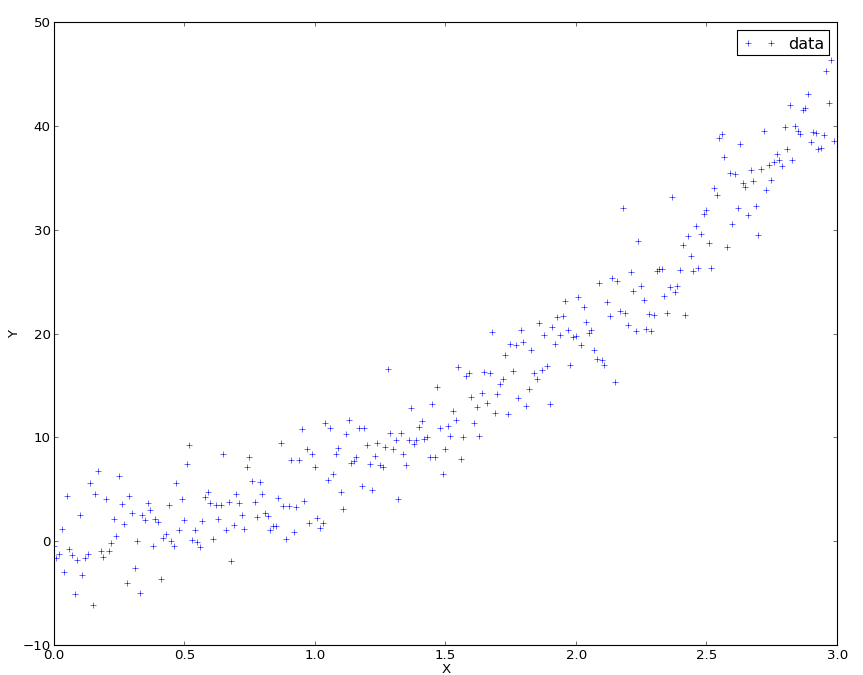
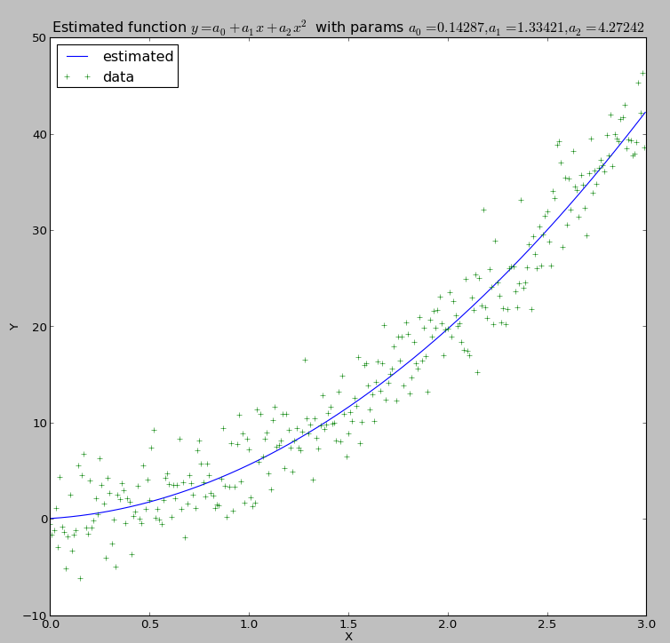
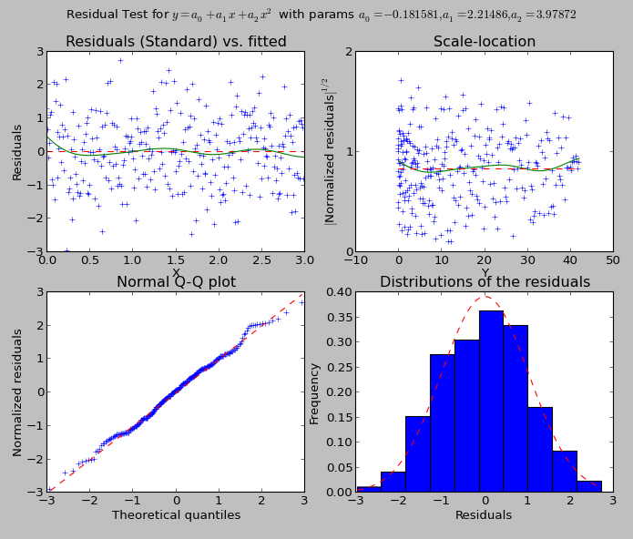
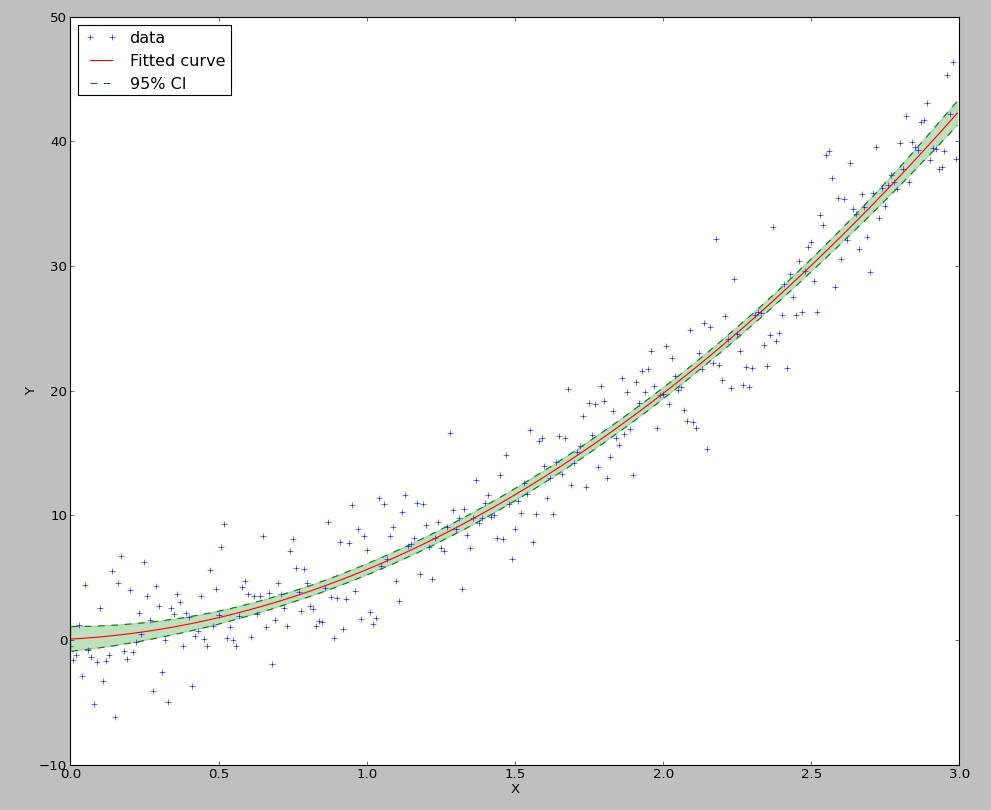

.. Python-based use of parametric regression

Parametric regression tutorial
==============================

Introduction
------------

Given a set of observations :math:`(x_i, y_i)`, with :math:`x_i = (x_{i1},
\ldots, x_{ip})^T \in \mathbb{R}^p`. We assume, there exists a function
:math:`f(\theta, x)` and a set of parameters :math:`\theta \in \mathbb{R}^q`
such that:

.. math::

  y_i = f(\theta, x_i) + \epsilon_i

with :math:`\epsilon_i \in \mathbb{R}` such that :math:`E(\epsilon) = 0`.

The objective is to fine the set of parameters `\theta`. Obviously, the real
function is inaccesible. Instead, we will try to find an estimate of the
parameters, :math:`\hat{\theta}` using the least square estimator, which is:

.. math::

  \hat{\theta} = \argmin_{\theta \in \mathbb{R}^q} \left( f(\theta,x_i) - y_i \right)^2

The method is based on the SciPy function ``scipy.optimize.leastsq``, which
relies on the MINPACK's functions ``lmdif`` and ``lmder``. Both functions
implement a modified Levenberg-Marquardt algorithm to solve the least-square
problem. Most of the output of the main curve fitting option will be the output
of the least-square function in scipy.

A simple example
----------------

As a simple example, we will take the function :math:`f` to be:

.. math::

  f((a_0,a_1,a_2),x) = a_0 + a_1 x + a_2 x^2

Let's assume the points look like this:

  Raw data for curve fitting

The data points have been generated by that script::

  >>> import numpy as np
  >>> from matplotlib import pylab as plt
  >>> x = np.arange(0,3,0.01)
  >>> y = 2*x + 4*x**2 + 3*np.random.randn(*x.shape)
  >>> plt.plot(x,y,'+',label='data')
  >>> plt.legend(loc=0)
  >>> plt.xlabel('X'); plt.ylabel('Y')

So we will expect to find something close to :math:`(0,2,4)`.

To perform the analysis, we first need to define the function to be fitted::

  >>> def f(params, x):
  ...   a0, a1, a2 = params
  ...   return a0 + a1*x+ a2*x**2

Then, we construct a :py:class:`CurveFitting` object, which computes and stores the
optimal parameters, and also behaves as a function for the fitted data::

  >>> import pyqt_fit
  >>> fit = pyqt_fit.CurveFitting(x,y,(0,1,0),f)
  >>> print "The parameters are: a0 = {0}, a1 = {1}, a2 = {2}".format(*fit.popt)
  The parameters are: a0 = 0.142870141922, a1 = 1.33420587099, a2 = 4.27241667343
  >>> yfitted = fit(x)

The ``fit`` object, beside being a callable object to evaluate the fitting
function as some points, contain the following properties:

  ``fct``
    Function being fitted (e.g. the one given as argument)

  ``popt``
    Optimal parameters for the function

  ``res``
    Residuals of the fitted data

  ``pcov``
    Covariance of the parameters around the optimal values.

  ``infodict``
    Additional estimation outputs, as given by :py:func:`scipy.optimize.leastsq`

Fitting analysis
^^^^^^^^^^^^^^^^

PyQt-Fit also has tools to evaluate your fitting. You can use them as a whole::

  >>> from pyqt_fit import plot_fit
  >>> result = plot_fit.fit_evaluation(fit, x, y,
  ...                                 fct_desc = "$y = a_0 + a_1 x + a_2 x^2$",
  ...                                 param_names=['a_0', 'a_1', 'a_2'])

You can then examine the ``result`` variable. But you can also perform only the
analysis you need. For example, you can compute the data needed for the
residual analysis with::

  >>> rm = plot_fit.residual_measures(fit.res)

``rm`` is a named tuple with the following fields:

  ``scaled_res``
    Scaled residuals, sorted in ascending values for residuals. The scaled
    residuals are computed as :math:`sr_i = \frac{r_i}{\sigma_r}`, where
    :math:`\sigma_r` is the variance of the residuals.

  ``res_IX``
    Ordering indices for the residuals in scaled_res. This orders the residuals
    in an ascending manner.

  ``prob``
    List of quantiles used to compute the normalized quantiles.

  ``normq``
    Value expected for the quantiles in ``prob`` if the distribution is normal.
    The foluma is: :math:`\Phi(p) = \sqrt{2}
    \erf^{-1}(2p-1), p\in[0;1]`

Plotting the results
^^^^^^^^^^^^^^^^^^^^

At last, you can use the display used for the GUI::

  >>> handles = plot_fit.plot1d(result)

What you will obtain are these two graphs:

  Curve fitting output

  Residual checking output

Do not hesitate to look at the code for :py:func:`pyqt_fit.plot_fit.plot1d` to examine
how things are plotted. The function should return all the handles you may need
to tune the presentation of the various curves.

Speeding up the fitting: providing the jacobian
^^^^^^^^^^^^^^^^^^^^^^^^^^^^^^^^^^^^^^^^^^^^^^^

The least-square algorithm uses the jacobian (i.e. the derivative of the function with respect to each parameter on each 
point). By default, the jacobian is estimated numerically, which can be quite expensive (if the function itself is). But 
in many cases, it is fairly easy to compute. For example, in our case we have:

.. math::

    \begin{array}{rcl}
    \frac{\partial f(x)}{\partial a_0} &=& 1 \\
    \frac{\partial f(x)}{\partial a_1} &=& x \\
    \frac{\partial f(x)}{\partial a_2} &=& x^2
    \end{array}

By default, the derivatives should be given in columns (i.e. each line correspond to a parameter, each column to 
a point)::

  >>> def df(params, x):
  ...   result = np.ones((3, x.shape[0]), dtype=float)
  ...   result[1] = x
  ...   result[2] = x**2
  ...   return result # result[0] is already 1
  >>> fit.Dfun = df
  >>> fit.fit()

Of course there is no change in the result, but it should be slightly faster (note that in this case, the function is so 
fast that to make it worth it, you need a lot of points as input).

Confidence Intervals
--------------------

PyQt-Fit provides bootstrapping methods to compute confidence intervals.
Bootstrapping is a method to estimate confidence interval and probability
distribution by resampling the data provided. For our problem, we will call::

  >>> import pyqt_fit.bootstrap as bs
  >>> xs = np.arange(0, 3, 0.01)
  >>> result = bs.bootstrap(pyqt_fit.CurveFitting, x, y, eval_points = xs, fit_kwrds = dict(p0 = (0,1,0), function = f), CI = (95,99), extra_attrs = ('popt',))

This will compute the 95% and 99% confidence intervals for the curves and for
the optimised parameters (``popt``). The result is a named tuple
:py:class:`pyqt_fit.bootstrap.BootstrapResult`. The most important field are
``y_est`` and ``CIs`` that provide the estimated values and the confidence
intervals for the curve and for the parameters.

On the data, the result can be plotted with::

  >>> plt.plot(xs, result.y_fit(xs), 'r', label="Fitted curve")
  >>> plt.plot(xs, result.CIs[0][0,0], 'g--', label='95% CI')
  >>> plt.plot(xs, result.CIs[0][0,1], 'g--')
  >>> plt.fill_between(xs, result.CIs[0][0,0], result.CIs[0][0,1], color='g', alpha=0.25)
  >>> plt.legend(loc=0)

The result is:

  Drawing of the 95% confidence interval

The bounds for the parameters are obtained with::

  >>> print "95% CI for p0 = {}-{}".format(*result.CIs[1][0])
  >>> print "99% CI for p0 = {}-{}".format(*result.CIs[1][1])
  95% CI for p0 = [-0.84216998 -0.20389559  3.77950689]-[ 1.14753806  2.8848943   4.7557855 ]
  99% CI for p0 = [-1.09413524 -0.62373955  3.64217184]-[ 1.40142123  3.32762714  4.91391328]

It is also possible to obtain the full distribution of the values for the curve
and for the parameters by providing the argument ``full_results=True`` and by
looking at ``result.full_results``.

Defining the functions and residuals
------------------------------------

User-defined function
^^^^^^^^^^^^^^^^^^^^^

The function must be a two argument python function:

  1. the parameters of the function, provided either as a tuple or a ndarray

  2. the values on which the function is to be evaluated, provided as a single value or a ndarray

If the second argument is a ndarray of shape ``(...,N)``, the output must be a ndarray of shape ``(N,)``.

If is also possible to provide the function computing the Jacobian of the
estimation function. The arguments are the same as for the function, but the
shape of the output must be ``(P,N)``, where ``P`` is the number of parameters
to be fitted, unless the option ``col_deriv`` is set to 0, in which case the
shape of the output must be ``(N,P)``.

User-defined residuals
^^^^^^^^^^^^^^^^^^^^^^

It is also possible to redefine the notion of residuals. A common example is to
use the log of the residuals. It is most applicable if the standard deviation
of the residuals is proportional to the fitted quantity. The residual should be
a function of two arguments:

  1. the measured data

  2. the fitted data

For example, the log residuals would be::

  >>> def log_residuals(y1, y0):
  ...   return np.log(y1/y0)

As for the user-defined function, it is possible to provide the jacobian of the
residuals. It must be provided as a function of 3 arguments:

  1. the measured data

  2. the fitted data

  3. the jacobian of the function on the fitted data

The shape of the output must be the same as the shape of the jacobian of the
function. For example, if ``col_deriv`` is set to True, the jacobian of the
log-residuals will be defined as::

  >>> def Dlog_residual(y1, y0):
  ...   return -1/y0[np.newaxis,:]

This is because:

.. math::

  \mathcal{J}\left(\log\frac{y_1}{y_0}\right) = -\frac{\mathcal{J}(y_0)}{y_0}

as :math:`y_1` is a constant, and :math:`y_0` depend on the parameters.

Also, methods like the residuals bootstrapping will require a way to apply
residuals on fitted data. For this, you will need to provide a function such as::

  >>> def invert_log_residuals(y, res):
  ...   return y*np.exp(res)

This function should be such that this expression returns always true::

  >>> all(log_residuals(invert_log_residuals(y, res), y) == res)

Of course, working with floating point values, this is usually not happening.
So a better test function would be::

  >>> sum((log_residuals(invert_log_residuals(y, res), y) - res)**2) < epsilon

Using the functions/residuals defined for the GUI
-------------------------------------------------

It is also possible to use the functions and residuals defined for the GUI. The
interface for this are via the modules :py:mod:`pyqt_fit.functions` and
:py:mod:`pyqt_fit.residuals`.

The list of available functions can be retrieved with::

  >>> pyqt_fit.functions.names()
  ['Power law', 'Exponential', 'Linear', 'Logistic']

And a function is retrieved with::

  >>> f = pyqt_fit.functions.get('Logistic')

The function is an object with the following properties:

  ``__call__``
    Evaluate the function on a set of points, as described in the previous section

  ``Dfun``
    Evaluate the jacobian of the function. If not available, this property is set to ``None``

  ``args``
    Name of the arguments

  ``description``
    Formula or description of the evaluated function

  ``init_args``
    Function provided a reasonnable first guess for the parameters. Should be called with ``f.init_args(x,y)``.

In the same way, the list of available residuals can be retrieved with::

  >>> pyqt_fit.residuals.names()
  ['Difference of the logs', 'Standard']

And a residuals function is retrieved with::

  >>> r = pyqt_fit.residuals.get('Difference of the logs')

The residuals is an object with the following properties:

  ``__call__``
    Evaluate the residuals, as described in the previous section

  ``Dfun``
    Evaluate the jacobian of the residuals. If not available, this property is set to ``None``

  ``invert``
    Function that apply the residuals to a set of fitted data. It will be
    called as ``r.invert(y, res)``. It should have the properties of the invert
    function described in the previous section.

  ``description``
    Description of the kind of residuals

  ``name``
    Name of the residuals.

